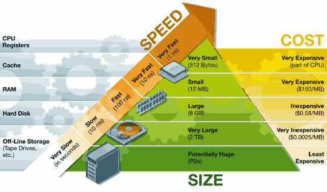

### 1. Introduction

The main functionality of CPU is nothing but executing programs.

Any data you store in the hard disk is permanent, unlike the memory systems like RAM, cache or registers. Which means, in case if the computer got switched off due to power cut, the data which is present in RAM or cache or registers will get lost.

we are not going to cut the data and paste the data. Rather, we are going to copy the data and paste the data. (= 하드 디스크에 있는 프로그램을 잘라서 램에 가져오는 것이 아니라, 복사해서 램에 가져온다는 의미)

So the contents of cache memory is a subset of the contents of RAM. And the contents of RAM is a subset of the contents of hard disk. Because, we are copying the data and placing it. (하드 디스크의 부분 집합은 램, 램의 부분집합은 캐시 메모리, 캐시 메모리의 부분 집합은 레지스터라는 의미)  

☆ Cost : Register > Cache momory > RAM > Hard disk 
☆ Capacity(= Size) : Register < Cache momory < RAM < Hard disk 
☆ Fastness : Register > Cache momory > RAM > Hard disk

