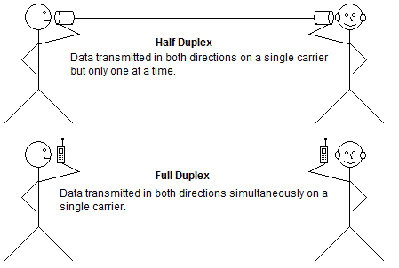
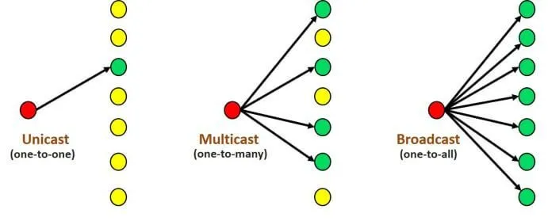

# Section 3. How Computer Networks Work

### 18. Introduction to Computer Networking Protocols

Computer communicate with each other with network protocols.

**Protocols are rules** governing how machines exchange data and enable effective communication.

**Physical Protocols** : describe **the medium**(wiring), **the connections**(RJ-45 port), and **the signal**(voltage level on a wire).

**Logical Protocols** : software controlling how and when data is sent and received to computers, supporting physical protocols.

Computer networks depend on many different types of protocols in order to work properly.

### 19. Introduction to the OSI Model

The Open Systems Interconnection (OSI) is **Reference Model**.

- **A conceptual framework** showing us **how data moves throughout a network**.
- Developed by the International Organization for Standardization(ISO) in 1977.
  
**OSI Model gives us a guide to understanding how networks operate. It's only a reference model. Wasn't implemented in the real word, TCP/IP is.**

The OSI Model breaks down the complex task of computer-to-computer network communications into seven layers.

- Upper Layers(Host Layers, L4 to L7) : Handled by the host computer and performs application-specific functions such as data formmating, encryption, and connection management.
- Lower Layers(Media Layers, L1 to L3) : Provide network-specific functions such as routing, addressing, and flow control.

|   Data  |        Layer       |                  Specific                  |
|:-------:|:------------------:|:------------------------------------------:|
|   Data  |  Application Layer |       Network Process to Application       |
|   Data  | Presentation Layer |      Data Representation & Encryption      |
|   Data  |    Session Layer   |           Interhost Communication          |
| Segment |   Transport Layer  |     End-to-End Connection & Reliability    |
|  Packet |    Network Layer   | Path Detemination & IP(Logical Addressing) |
|  Frame  |   Data Link Layer  |      MAC and LLC(Physical Addressing)      |
|   Bit   |   Physical Layer   |    Media, Signal & Binary Transmissions    |

**P**lease **D**o **N**ot **T**hrow **S**ausage **P**izza **A**way

### 20. Introduction to the TCP/IP Model

The TCP/IP suite is the most commonly used protocol suite in the networking world.

It’s essentially the protocol suite in which the Internet was built.

It’s the standard for computer networking.

It is based on a 4-layer model that is similar to the OSI model.

|   Data  |        Layer       |                  Specific                  |
|:-------:|:------------------:|:------------------------------------------:|
|   Data  |  Application Layer |       Network Process to Application       |
|   Data  | Presentation Layer |      Data Representation & Encryption      |
|   Data  |    Session Layer   |           Interhost Communication          |
| Segment |   Transport Layer  |     End-to-End Connection & Reliability    |
|  Packet |    Network Layer   | Path Detemination & IP(Logical Addressing) |
|  Frame  |   Data Link Layer  |      MAC and LLC(Physical Addressing)      |

### 21. Introduction to MAC Addresses  (Update 2021 Lecture)

☆ Both IP addresses and MAC addresses is that they allow us to uniquely identify a device on a network.

- Media Access Control (MAC)
  - Physical address of the network adpater card
  - OSI Layer 2 : Data Link
  - TCP/IP Layer 1 : Network Interface 
- **Six bytes** (48 bits), Usally Represented **Hexadecimal** : $2^{24}$ $\approx$ 16.7 백만
  - **First three bytes** (24 bits) are assigned **by the IEEE** to the manufacturer
  - **Last three bytes** (24 bits) are usyally assigned sequentially **by manufacturer**

Network Interface Card has a MAC address. MAC address is physically burned onto a **ROM chip** on the NIC itself. So you can't change it. You may have heard that you can change it in the OS. That's called **spoofing a MAC address**, but you are actually not changing it on the card itself.

The MAC address is associated with OSI layer two or TCP/IP layer one.

A MAC address is a physical address. It's physically burned onto the ROM chip within a network interface card and it cannot be changed on that card.

MAC addresses are associated with layer two, which is the data link layer, and that's typically associated with switches.

### 22. Introduction to IP Addresses  (Update 2021 Lecture)

☆ Both IP addresses and MAC addresses is that they allow us to uniquely identify a device on a network.

- An IP Address is a logical address used in order to uniquely identify
a device on an IP network.
- It’s a Network Layer address associated with routing
  - OSI Layer 3: Network Layer
  - TCP/IP Layer 2: Internet Layer
- There are two versions
  - IP version 4 (IPv4) c.f. 192.168.0.1
  - IP version 6 (IPv6) c.f. 2001:DB8:85A3:0:0:8A2E:370:7334
  
Unlike a MAC address, we actually have to assign it ourselves within an operating system.

### 23. IP versus MAC Addresses  (Update 2021 Lecture)

- IP addresses  
  -  Network (OSI Layer 3) Addresses
  -  Logical Addresses
  -  Assigned in Operating System 
  -  Allows network-to-network 
  -  communication via routers 
  -  WAN communication

   

  ☆ We logically assign IP addresses  within the operating system. And when we say assigned, it's either going to  be statically or dynamically. And in short, if it's static, it means that you and I, we manually type it in. If it's dynamic, we use something that's called a DHCP server to assign the IP addresses.

   

  ☆ IP addresses allow us to have network to network communication via routers, meaning communicating from your own network to another network. 

   

- MAC addresses
  - Data Link (OSI Layer 2) Addresses 
  - Physical Addresses 
  - Physically burned on NIC 
  - Allows internetwork communication via hubs, switches, and routers 
  - Local LAN communication

   

  ☆ MAC addresses are physically burned onto the network interface card(specifically say ROM chip).  you can spoof it within the operating system, but you can't actually change it on the network interface card. MAC addresses are used for inter-network communication, meaning communication within the network that you're currently in. MAC addresses are used for local area network communication.

### 24. Duplex Communication  (Update 2021 Lecture)

- Network communication will occur in either full or half duplex mode
  - **Half Duplex** : Can send and receive data, but not at the same time
  - **Full Duplex** : Can send and receive data simultaneously.

### 25. Network Transmission Types  (New 2021 Lecture)

- Unicast : One - to - One
- Multicast : One - to - Many
- Boradcast : One - to - All

### 26. Introduction to Ethernet  (Update 2021 Lecture)

- The most popular networking technology in the world! 
- Refers to a family of standards that define the physical and logical aspects of the world's most popular type of LAN. 
- The standard communications protocol for building a local area network (LAN).

Ethernet is a family of standards and it's a family of standards that not only apply to the physical aspects of a network, but also to the logical aspects of a network.

- Physical
  - Cabling, Connectors, Equipment, etc.
- Logical 
  - Network Access Method, i.e., Carrier Sense Multiple Access (CSMA