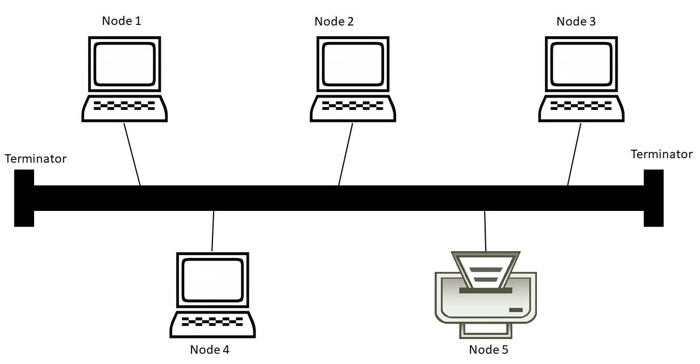
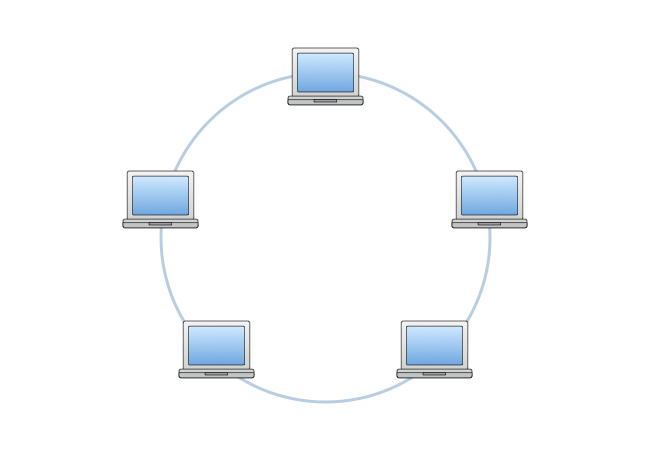
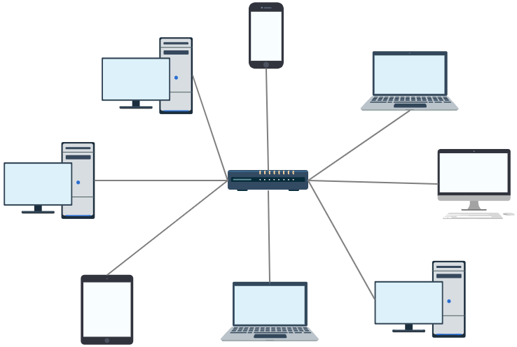
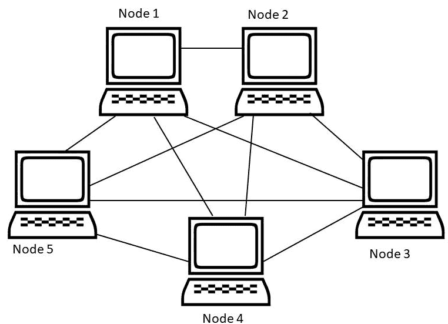
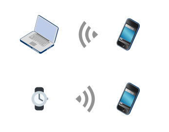
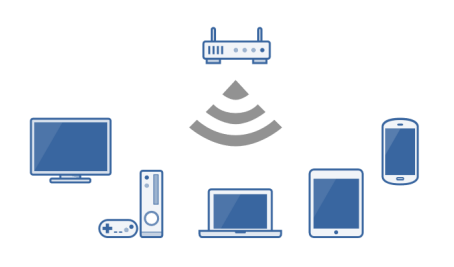
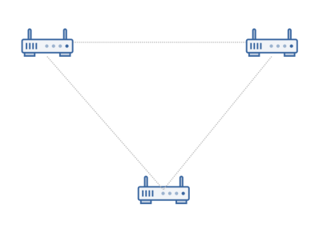

# Section 4. Network Topologies

### 29. Section Introduction

First we're going to talk about the difference between **physical and logical network topologies**.  Then we're going to talk about **wired topologies** and then **wireless topologies**.

### 30. Physical vs. Logical Topologies

A network is composed of two components.  It has a physical component and it has a logical component.

- **Physical Topology** : Physical topologies describe **the placement of network devices** and **how they are physically connected**.
- **Logical topologies** : Logical topologies describe **how data flows throughout a network**. c.f. CSMA/CD (wried), CSMA/CA (wireless)

☆ Topology is blueprint.

### 31. Wired Network Topologies

☆ Four Specific Topologies : Bus, Ring, Start, Mesh

**1. Bus wired Topology**
  - All devices are connected to a single coaxial network cable.
    - Devices are connected via a vampire tap or T-Connector.
    - Terminators are required at both ends of the cable to prevent signal bounce.
    - **Antiquated technology.**
  - **Only one end device can be active on the network at a time.**
    - Data signals travel in both directions and are received by all devices on the network.
  - **A single break in the cable can take down the entire network.**

 

**2. Ring wired Topology**
  - All devices are connected in a circular fashion.
  - Each computer is connected to two other computers.
  - Data travels from node-to-node with each computer handling data, either unidirectional or bidirectional.
  - **Each device (node) in the ring regenerates the signal, acting as a repeater.**
  - **Failure of a single node can take down the entire network.**
  - Fiber Distributed Data Interface (FDDI) uses two counter-rotating ring topologies for redundancy. 

**3. Star wired Topology**
  - **All devices are connected to a central connecting device, which is usually a switch.**
  - Devices send data to the switch, which forwards it to the appropriate destination device.
  - **Popular topology in today’s networks.**
  - Used in most large and small networks.
  - **Central device is a single point of failure.**

**4. Mesh wired Topology**
  - Each device is connected to every other device by separate cabling.
  - **Highly redundant and fault-tolerance.**
  - **Expensive to install.**
  - Commonly used in Enterprise Networks & WANs.
  - Two Types
    - Partial Mesh (모든 노드가 자신을 제외한 모든 노드에 연결되어 있지 않음)
    - Full Mesh (모든 노드가 자신을 제외한 모든 노드에 연결되어 있음)

### 32. Wireless Network Topologies

☆ Wireless networks utilize **radio frequencies (RF)** to communicate.
☆ Three Specific Topologies : Ad hoc, Infrastructure, Mesh
☆ All of these are currently in use.

**1. Ad hoc wireless topology**
   - **Peer-to-peer (P2P) wireless network** where no wireless access point (WAP) infrastructure exists. **There is no central connecting device**, there is no wireless access point.
   - **The devices communicate directly** with one another.
   - **Personal area networks** (PANs) are a common example of Ad hoc wireless networks.

**2. Infrastructure wireless topology** : stereotypical wireless network
  - Wireless network that uses **a wireless access point (WAP)** as its **central connecting device**. And that wireless access point connects to our wired network.
  - Infrastructure wireless networks (**WLANs**) are commonly used in homes and small offices. 
  - there's no such thing as a completely wireless network. Somewhere along that network this connects to a wired network.

**3. Mesh wireless topology**
  - Just like a wired mesh design, wireless mesh networks utilize **several wireless access points** (nodes) to create a robust wireless network that is : Scalable, Self-Healing, Reliable (redundancy) 
    - Scalable : 하나 이상의 WAP가 존재하므로 큰 규모에 적용 가능
    - Self-Healing : 하나의 WAP이 다운되더라도 다른 WAP으로 연결 가능
    - Reliable (redundancy) : 여러 WAP이 존재하므로 신뢰성이 있음, 신뢰할 수 있는 중복성
  - Common in larger homes and businesses.
  
