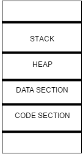

# Section 3. Operating System Concepts 

### 7. Program vs Process, States of a process
- Program
  - Executable files which are present in our hard disk.
  - nothing but software
- Process
  - If I clicked the Google Chrome software(= program), a new copy of this program will be created in the hard disk itselft. A new copy of this program is called process.
  - **A single program, multiple processes can be created.**

**State of Process** : Process undergoes various stages.
- New state : Program has actually created process. process is being newly created by program.
- Ready state  : Waiting for some event to happen, which means that process is actually ready for execution(CPU) or for performing I/O. 
- Running state : Process is being executed by the CPU taking line-by-line. Process is being run by CPU or being executed by the CPU. ※ Running == Executing
- I/O state : Process in RAM is performing some I/O event. Process is undergoing I/O. It is also called Block state. ※ Either reading or writing form I/O devices is what we say as I/O
- Terminated state : A process has actally completed its execution, which means it is completely done with everthing. It will be completly removed from the RAM.  
- Suspend Ready state : Explaining later
- Suspend wait state : Explaining later

**Entire journey of program**
   1. Initially it started as a source program then it has been converted into machine code.
   2. Now machine code has been placed inside the hard disk.
   3. And then it has been moved into the RAM.
   4. Now once it has moved into the Ram, it can undergo either I/O or it can be executed by the CPU or it can simply remain in the RAM, waiting for some event to happen (or for execution by CPU ir wauting for I/O)

### 8. Degree of Multiprogramming
Degree of programming is nothing but maximum number of processes which can be present in the RAM of our computer.

For example, I have a computer which has 4GB RAM. Assume that a size of a single process is 4KB. Now, My computer can have $2^{20}$ processes inside the RAM.

** 참고 : 1KB = $2^{10}$, 1MB = $2^{20}$, 1GB = $2^{30}$, 1TB = $2^{40}$, 1Byte = 8 bits

### 9. Types of Operating Systems

☆ **CPU efficiency** = **Useful time of CPU**(CPU가 실제로 일한 시간) / **Total Time of CPU**(컴퓨터 켠 후 지금까지의 시간)

FASTNESS : Batch OS < Multiprogramming OS < Multiprocessing OS

1. **Batch operating system** : degree of multiprogramming is always 1. That means, only one process can be placed inside the RAM.
CPU(execution) and I/O devices can work in parrallel. But, Execution and I/O devices can't be done at the same time for 'a particular process'. Parrallel means that if a process is being executed by CPU, I/O is working for another process vice versa.
So, Batch operating system is the most lowest 'CPU efficiency' compare to other OS. Because a process is done by CPU or I/O devices, then taking a another process from hard disk to RAM. If a another process needs I/O devices, CPU is doing nothing. Less CPU efficiency means computer is slow.

 

2. **Multiprogramming operating system** : degree of multiprogramming is more than 1. That means, We can have more than one process in the RAM. It makes CPU efficiency improve. Which means if one of the processes is undergoing I/O, at the same time I can execute some other process. Which menas, I'm not allowing the CPU to remain idle. So CPU efficiency is going to improve in multiprogramming ooperating systems.

 

3. **Multiprocessing operating system** : This OS can have more than one CPU. Whatever we are using today in our computers is multi-processing operating systems. (Octa core processor, Quad core processor means that in my computer there are 6, 8 processor each.) This means one process is being executed by this CPU(central processing unit), some other process will also be executed by this another CPU.

☆ **Parallel processing(병렬 연산)** vs **Concurrent processing(동시 연산)** : Can't understand

Parrallel processing means, we are executing more than one process at the same time. Multiprocessing OS is actually doing concurrent processing.
Definitely parallel processing will be faster than concurrent processing. But actually the disadvantage with that si in parrallel processing the system cost will increase.

☆ Batch OS and Multiprogramming OS can have only one CPU. But multiprocessing OS can have more than one CPU. 

### 10. An Important point to note
Throughout this course we will mostly be using something called as multiprogramming OS not multiprocessing OS.

### 11. Process Control block, Attributes of a process

☆ For every program, a process will be created whenever user opens the program.

- Passive entity : maybe means 'Program'. The program for which the process is created is also called as "Passive entity"
- Active entity : maybe means 'Process'. The process which is actually created for the program is also called as "Active entity"

** [Sections of a Process](https://www.thedailyprogrammer.com/2016/08/processes-in-operating-system.html) - 구글링해서 찾아본 부분
A process is divided into four major sections:

1. **Code Section**: **Code section consists of the code, or instructions of the process.** Basically, it is indicatged by the program counter and instruction registers which hold the current and to-be executed instructions.
2. **Data Section**: **This section contains static and global variables**, which are initialized before the program is executed.
3. **Heap Section**: This consists of **dynamically allocated memory** in the process, using free, alloc, malloc etc. calls.
4. **Stack Section**: This contains **local variables** of process and other temporary data, such as address of next instruction during **function calls**. Contents of this section are automatically destroyed in the order of the stack, as and when they reach the end of their scope.

- Heap (memory) : Dynamic lemory allocation at the runtime. c.f. calloc(), malloc()
- Stack (memory) : a function is called -> stack.push, a function is being executed by CPU -> stack.pop

☆ There is no fixed space(= size) for stack or heap. It really depends on the program itself.
☆ If some programs will have more dynamic memory allocation, the heap will be growing up. Whereas stack will be growing down. 
☆ If some programs will have more function calls, stack will be growing up. Whereas heap will be growing down.

- **Process Control Block (PCB)** :  Process Control Block is a data structure maintained by the operating system to store information of each process.
  - For every process, it has a PCB each.
  - A process will not only contain just program, but it will also have some more things like stack, heap and static and global variable
  - RAM 안에서 PCB 단위(스택, 힙, 코드 섹션, 데이터 섹션을 포함한 '메모리' 그리고 process attributes)로 프로세스가 관리된다는 내용인듯

 

- **Process Attributes** : 매우 어려웠음 :(
  - **Process ID (PID)** : A unique number. Every process will be assigned a number by OS, and that number will be given to only this(one) process and not to any other process.
  - **program counter** : A program counter is a register in a computer processor that contains the address (location) of the instruction being executed at the current time. Program counter will actually say the instruction number. Instruction number is nothing but the line of program from where I need to continue the execution. Program counter is nothing but a register. Which will be maintained closer to the CPU. If my OS is using Shortest Job First Scheduling Algorithm, let us assume that P1 takes 9 ms, P2 takes 6ms and P3 takes 5 ms. So, my OS takes P3 to CPU. while running P3 by CPU, P4 which takes 1 ms comes into RAM. Then, P3 has to be forcefully stopped. This process has to be stopped from execution of CPU. Now, P4 has to be scheduled by the scheduler. See P3 is not yet completed. P3 is not yet completed but it is stopped at 3th line of code. Program counter remember where its code stopped.
  - **process state** : It is explained by before lecture.
  - **general purpose registers** : General purpose registers are additional registers that are present in CPU which is used for either memory address or data whenever needed.
  - **priority** : Priority scheduling in OS is the scheduling algorithm which schedules processes according to the priority assigned to each of the processes.
  - **list of open files** : Which means that files which are being opened by process P3 should have been remembered. when we continue after being preempted.
  - **list of open devices** : Which means that devices which are being opened by process P3 should have been remembered.. when we continue after being preempted.
  - **protection** : A process is not using the space of another process.

  ☆ Shortest Job First Scheduling Algorithm (SJF) :  Shortest Job First (SJF) is an algorithm in which the process having the smallest execution time is chosen for the next execution. 

  ☆ First Come First Serve scheduling algorithm : First Come, First Served (FCFS) is a type of scheduling algorithm used by operating systems and networks to efficiently and automatically execute queued tasks, processes and requests by the order of their arrival. (큐 비슷한 거..?)